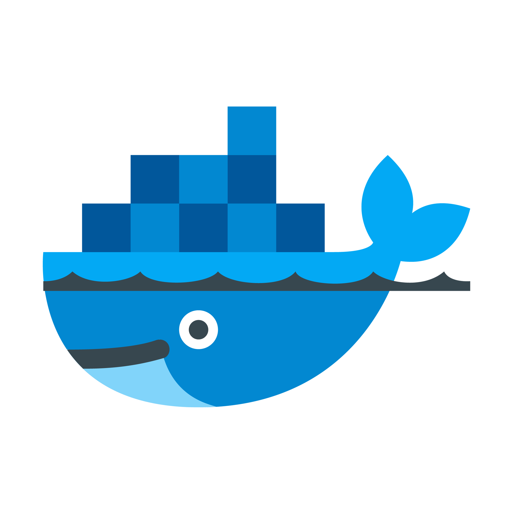
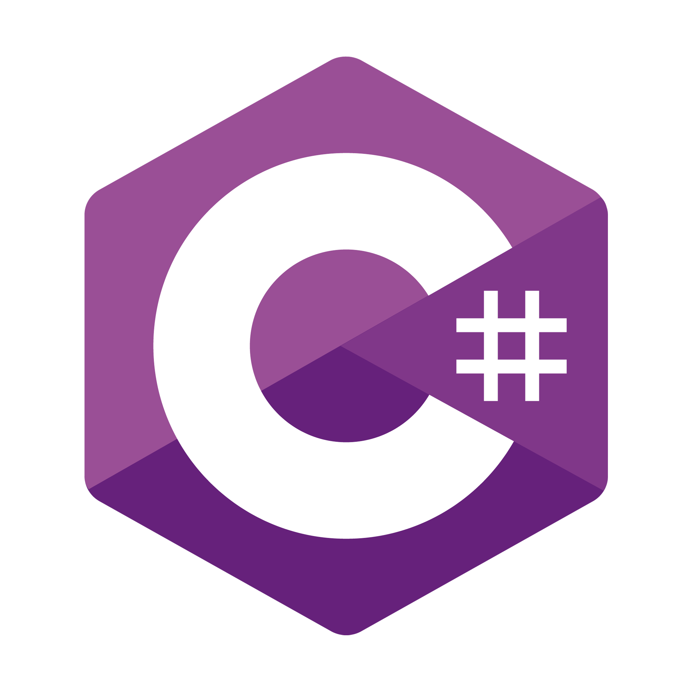

<h2 align="center">Olá, eu sou Tiago Lourinho!</h1>

### Sobre mim

Sou desenvolvedor web formado pela <strong><a href="https://www.betrybe.com/" style="text-decoration: none">Trybe</a></strong>, com 42 anos, de Brasília. Antes da programação, atuei por muitos anos como designer gráfico, focado em tratamento de imagens e diagramação de álbuns de casamento. Agora, em transição de carreira, estou mergulhando de cabeça no mundo do código e adorando cada desafio.

No tempo livre, sou gamer de PC, especialmente fã de RPGs. Também curto música and play the BASS. Filmes, séries, livros, HQs - se tiver um toque de nerdice, melhor ainda!

##

### Linguagens e ferramentas

  
  
  
  
  
  
  
  
  
  
  
  
  
  
  
  

##

### Estatísticas do GitHub

  
  
  

##

### Contato

  
  

